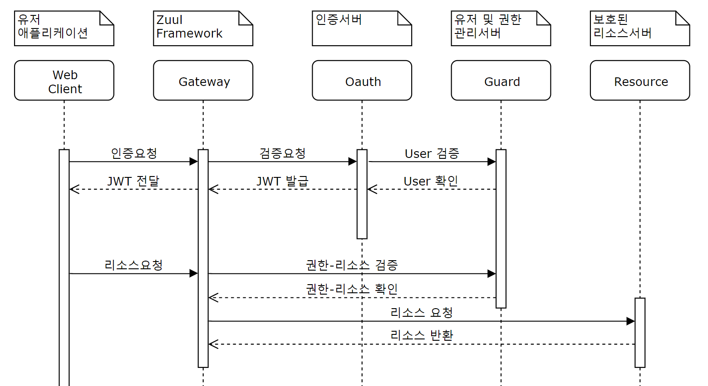

# Zuul (Gateway)
## Project MO

Zuul Gateway 는 `보안 및 로깅`의 주체입니다.

Gateway에서 모든 보안과 로깅을 관리하기 때문에 Gateway 뒤에 관리되는 모든 서버들은 보안과 로깅에 대해서 신경쓰지 않습니다.

각각의 서버들은 별도로 독립적으로 존재하며 Gateway의 존재를 모릅니다.

따라서 Gateway 의존적인 코드가 존재하면 안됩니다.


### 보안

Gateway는 Oauth서버를 통해 인증받은 토근을 통하여 리소스를 관리합니다.



- `Oauth2 서버`
  - 인증을 처리하는 분리된 서버이며 유저 정보를 확인하기 위해서 Guard 서버에 요청을 보냅니다.
  - 유저검증을 진행한 후 유효한 유저가 맞다면 유저정보를 포함한 JWT를 발급합니다.
- `Guard 서버`
  - 캐싱에 대한 부분을 추가적으로 구성할 예정입니다.
  - 매 요청마다 권한에 대한 검증을 진행해야 하기 때문에 비용적인 측면에서 부담이 될 수 있습니다.
  - <u>[TODO]</u> 따라서 Guard 서버내에 권한 정보를 동적으로 구성하면 Gateway에 배포 하는 방식으로 네트워크 부하량을 줄일 수 있습니다.
- `Resource 서버`
  - 보호된 자원을 가진 서버이며, 실제 라이브에서는 여러 서버스로 구성될 수 있습니다.


> 핵심 역할에 따라 서버를 구성했기 때문에 비용적인 측면에서 불리할 수 있습니다.
>
> 실제 라이브 서비스에선 가용한 자원에 따라 서버를 합쳐서 구성할 수 있습니다.


### 인가

인가처리를 진행하기 위해 Gateway는 연결 Server의 인가 체계를 Map 구조로 캐싱합니다.

캐싱은 메시지큐(Kafka)를 이용하여 수정사항이 있을 때 마다 추가적으로 배포됩니다.


> Server 제공 RESTful  구조

```
[GET] /api/gateway/path?offset={n}&limit={m}
[POST] /api/gateway/path
[GET] /api/gateway/path/{pathId}
[PUT] /api/gateway/path/{pathId}
[DELETE] /api/gateway/path/{pathId}
```

> Gateway 캐싱 구조

- PathVariable 구조는 `{}` 으로 파싱합니다. 
  - 특정 API 경로를 찾지 못하면 `{}` 경로로 빠지게 됩니다.

```json
{
	"api" : {
        "gateway" : {
            "path" : {
                "{}" : {
                    "GET" : [ "admin", "writer", "reader" ],
                    "PUT" : [ "admin", "writer" ],
                    "DELETE" : [ "admin" ]
                },
                "GET" : [ "admin" ],
                "POST" : [ "admin", "reader" ]
            }
        }
    }
}
```


### 로깅

<u>[TODO]</u>

Gateway는 모든 Request / Response 정보를 파일단위로 저장합니다.

해당 정보를 ELK에서 지속적으로 가져옵니다.